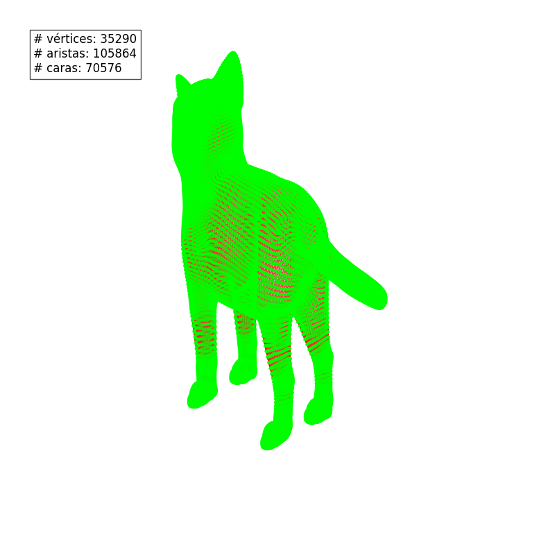
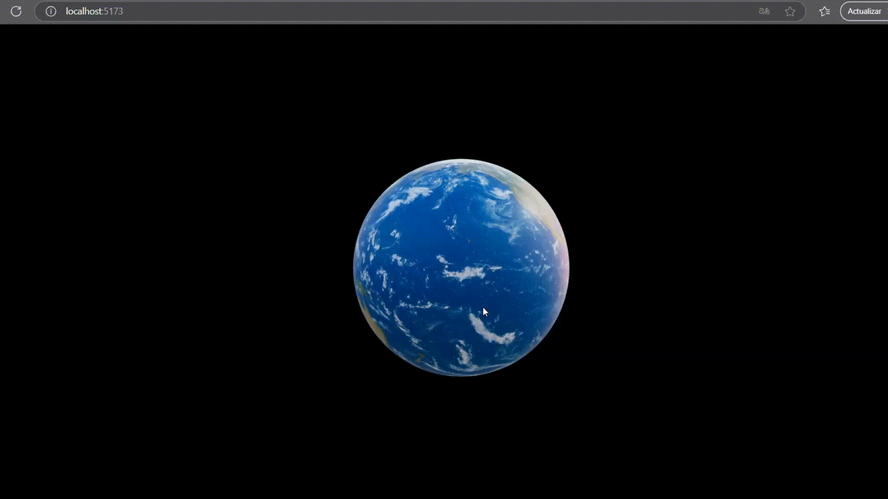

# 🧪 Taller Construyendo Mundo 3D

## 📅 Fecha
`2025-05-07` – Fecha de entrega

---

## 🎯 Objetivo del Taller
Comprender las estructuras gráficas básicas que forman los modelos 3D (mallas poligonales) y visualizar su estructura en distintas plataformas. Se explorará la diferencia entre vértice, arista y cara, así como el contenido de formatos de archivo estándar de malla como .OBJ, .STL y .GLTF.

Este repositorio contiene dos implementaciones que demuestran el uso de **estructuras 3d** en distintos entornos.

---

## 🧠 Conceptos Aprendidos

Principales conceptos aplicados:

- [X] Transformaciones geométricas (escala, rotación, traslación)
- [ ] Segmentación de imágenes
- [ ] Shaders y efectos visuales
- [ ] Entrenamiento de modelos IA
- [ ] Comunicación por gestos o voz
- [ ] Otro: _______________________

---

## 🔧 Herramientas y Entornos

Entornos usados:

Three.js / React Three Fiber
Jupyter / Google Colab

---

## 🧪 Implementación

Proceso:

### 🔹 Etapas realizadas
1. Preparación de datos o escena.
2. Aplicación de modelo o algoritmo.
3. Visualización o interacción.
4. Guardado de resultados.

### 🔹 Código relevante

Incluye un fragmento que resuma el corazón del taller:

```python

# Loading a file with trimesh
def load_model(path):
    mesh = trimesh.load_mesh(path)
    vertices = mesh.vertices
    faces = mesh.faces

    # Delete double edges
    unique_edges = set(frozenset(edge) for edge in mesh.edges)
    edges = np.array([list(e) for e in unique_edges])
    return vertices, edges, faces
```
```javascript

//Load model
import Earth from '../public/Earth'

// Show model with canvas
    <Canvas camera={{ position: [0, 2, 5], fov: 50 }}>
      <OrbitControls enableZoom={false}/>
      <ambientLight intensity={0.5} />
      <directionalLight position={[5, 5, 5]} />
      <Suspense fallback={null}>
        <Earth />
      </Suspense>
      <Environment preset='sunset' />
    </Canvas>
```
---

## 📊 Resultados Visuales




## ✅ Checklist de Entrega

- [x] Carpeta `2025-04-21_taller1_estructuras_3d`
- [x] Código limpio y funcional
- [x] GIF incluido con nombre descriptivo (si el taller lo requiere)
- [x] Visualizaciones o métricas exportadas
- [x] README completo y claro
- [x] Commits descriptivos en inglés

---
