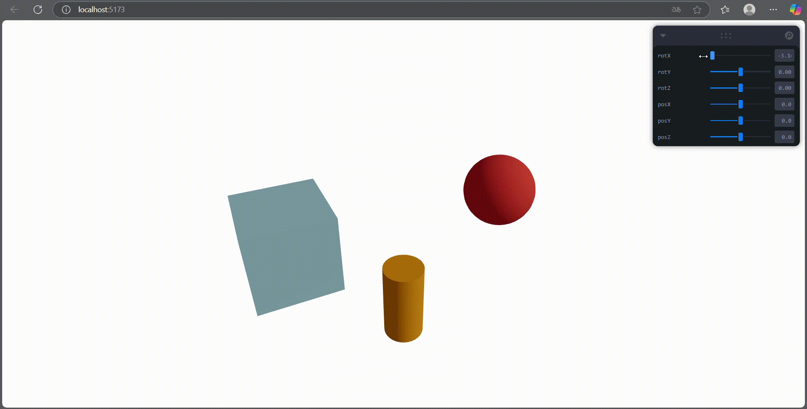

# 🧪 Taller Jerarquías Transformaciones: El Árbol del Movimiento

## 📅 Fecha
`2025-05-07` – Fecha de entrega

---

## 🎯 Objetivo del Taller
Aplicar estructuras jerárquicas y árboles de transformación para organizar escenas y simular movimiento relativo entre objetos. Se busca comprender cómo las transformaciones afectan a los nodos hijos en una estructura padre-hijo y cómo visualizar estos efectos en tiempo real.

Este repositorio contiene una implementacion que demuestran el uso de **estructuras para organización de escenas** en three js.

---

## 🧠 Conceptos Aprendidos

Principales conceptos aplicados:

- [X] Transformaciones geométricas (escala, rotación, traslación)
- [ ] Segmentación de imágenes
- [ ] Shaders y efectos visuales
- [ ] Entrenamiento de modelos IA
- [ ] Comunicación por gestos o voz
- [ ] Otro: _______________________

---

## 🔧 Herramientas y Entornos

Entornos usados:

Three.js / React Three Fiber

---

## 🧪 Implementación

Proceso:

### 🔹 Etapas realizadas
1. Preparación de datos o escena.
2. Aplicación de modelo o algoritmo.
3. Visualización o interacción.
4. Guardado de resultados.

### 🔹 Código relevante

Incluye un fragmento que resuma el corazón del taller:

```javascript

// Real-time controls for parent group transformation
  const { rotX, rotY, rotZ, posX, posY, posZ } = useControls({
    rotX: { value: 0, min: -Math.PI, max: Math.PI },
    rotY: { value: 0, min: -Math.PI, max: Math.PI },
    rotZ: { value: 0, min: -Math.PI, max: Math.PI },
    posX: { value: 0, min: -5, max: 5 },
    posY: { value: 0, min: -5, max: 5 },
    posZ: { value: 0, min: -5, max: 5 }
  })
```

---

## 📊 Resultados Visuales



## ✅ Checklist de Entrega

- [x] Carpeta `2025-04-21_taller2_jerarquias_transformaciones`
- [x] Código limpio y funcional
- [x] GIF incluido con nombre descriptivo (si el taller lo requiere)
- [x] Visualizaciones o métricas exportadas
- [x] README completo y claro
- [x] Commits descriptivos en inglés

---