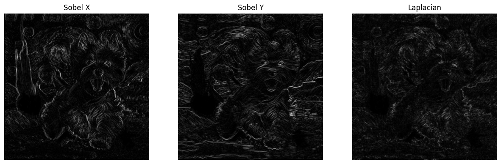
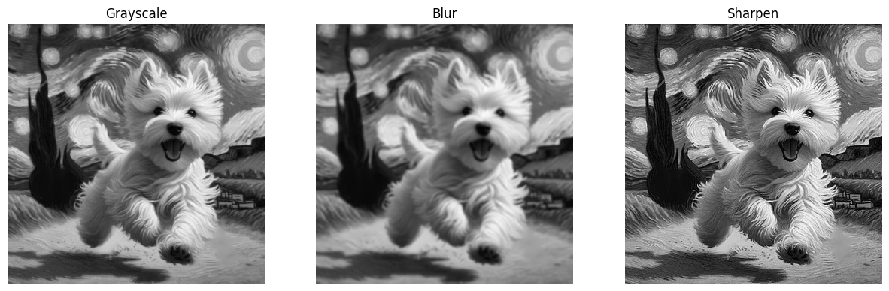

# 🧪 Taller Ojos Digitales: Introducción a la Visión Artificial

## 📅 Fecha
`2025-05-07` – Fecha de entrega

---

## 🎯 Objetivo del Taller
Entender los fundamentos de la percepción visual artificial mediante imágenes en escala de grises, filtros y detección básica de bordes. Se trabajará con OpenCV para explorar cómo los computadores interpretan imágenes visuales básicas.

Este repositorio contiene una implementación que demuestran el uso de **filtros de imagenes** en colab.

---

## 🧠 Conceptos Aprendidos

Principales conceptos aplicados:

- [ ] Transformaciones geométricas (escala, rotación, traslación)
- [X] Segmentación de imágenes
- [ ] Shaders y efectos visuales
- [ ] Entrenamiento de modelos IA
- [ ] Comunicación por gestos o voz
- [ ] Otro: _______________________

---

## 🔧 Herramientas y Entornos

Entornos usados:

Jupyter / Google Colab

---

## 🧪 Implementación

Proceso:

### 🔹 Etapas realizadas
1. Preparación de datos o escena.
2. Aplicación de modelo o algoritmo.
3. Visualización o interacción.
4. Guardado de resultados.

### 🔹 Código relevante

Incluye un fragmento que resuma el corazón del taller:

```python

# Gray
img_gray = cv2.cvtColor(image, cv2.COLOR_BGR2GRAY)

# Blur
blur_kernel = np.ones((5, 5), np.float32) / 25
img_blur = cv2.filter2D(img_gray, -1, blur_kernel)

# Sharpening
sharpen_kernel = np.array([[0, -1, 0],
                           [-1, 5, -1],
                           [0, -1, 0]])
img_sharpen = cv2.filter2D(img_gray, -1, sharpen_kernel)

# Sobel X
sobelx = cv2.Sobel(img_gray, cv2.CV_64F, 1, 0, ksize=3)

# Sobel X
sobely = cv2.Sobel(img_gray, cv2.CV_64F, 0, 1, ksize=3)

# Laplacian
laplacian = cv2.Laplacian(img_gray, cv2.CV_64F)
laplacian_abs = np.abs(laplacian)
```

## 📊 Resultados Visuales





## ✅ Checklist de Entrega

- [x] Carpeta `2025-04-21_taller3_ojos_digitales`
- [x] Código limpio y funcional
- [x] GIF incluido con nombre descriptivo (si el taller lo requiere)
- [x] Visualizaciones o métricas exportadas
- [x] README completo y claro
- [x] Commits descriptivos en inglés

---
