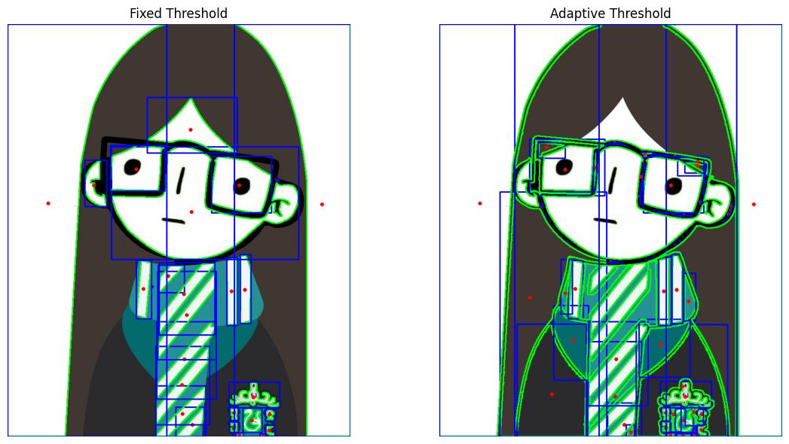

# 🧪 Taller Segmentando el Mundo: Binarización y Reconocimiento de Formas

## 📅 Fecha
`2025-05-07` – Fecha de entrega

---

## 🎯 Objetivo del Taller
Aplicar técnicas básicas de segmentación en imágenes mediante umbralización y detección de formas simples. El objetivo es comprender cómo identificar regiones de interés en imágenes mediante procesos de binarización y análisis morfológico.

Este repositorio contiene una implementación que demuestran el uso de **segmentación de imagenes** en colab.

---

## 🧠 Conceptos Aprendidos

Principales conceptos aplicados:

- [ ] Transformaciones geométricas (escala, rotación, traslación)
- [X] Segmentación de imágenes
- [ ] Shaders y efectos visuales
- [ ] Entrenamiento de modelos IA
- [ ] Comunicación por gestos o voz
- [ ] Otro: _______________________

---

## 🔧 Herramientas y Entornos

Entornos usados:

Jupyter / Google Colab

---

## 🧪 Implementación

Proceso:

### 🔹 Etapas realizadas
1. Preparación de datos o escena.
2. Aplicación de modelo o algoritmo.
3. Visualización o interacción.
4. Guardado de resultados.

### 🔹 Código relevante

Incluye un fragmento que resuma el corazón del taller:

```python
# Draw contour
cv2.drawContours(output, [cnt], -1, (0, 255, 0), 2)

# Moments and center of mass
M = cv2.moments(cnt)
if M["m00"] != 0:
  cx = int(M["m10"] / M["m00"])
  cy = int(M["m01"] / M["m00"])
  cv2.circle(output, (cx, cy), 4, (0, 0, 255), -1)

# Bounding box
x, y, w, h = cv2.boundingRect(cnt)
cv2.rectangle(output, (x, y), (x + w, y + h), (255, 0, 0), 2)

# Metrics
area = cv2.contourArea(cnt)
perimeter = cv2.arcLength(cnt, True)
total_area += area
total_perimeter += perimeter

# Convert BGR to RGB for display with matplotlib
output_rgb = cv2.cvtColor(output, cv2.COLOR_BGR2RGB)
return output_rgb
```

## 📊 Resultados Visuales




## ✅ Checklist de Entrega

- [x] Carpeta `2025-04-21_taller4_segmentación_formas`
- [x] Código limpio y funcional
- [x] GIF incluido con nombre descriptivo (si el taller lo requiere)
- [x] Visualizaciones o métricas exportadas
- [x] README completo y claro
- [x] Commits descriptivos en inglés

---