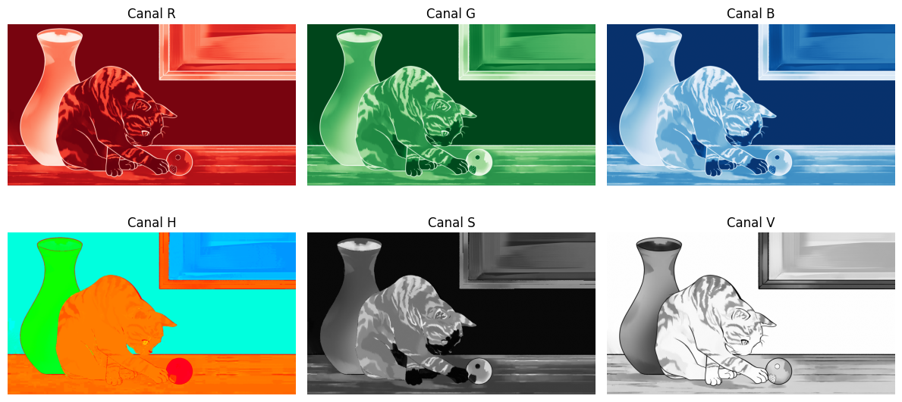
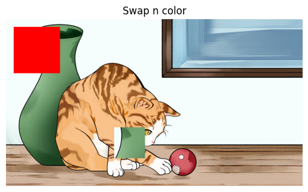

# 🧪 Taller de Pixeles a Coordenadas: Explorando la Imagen como Matriz

## 📅 Fecha
`2025-05-07` – Fecha de entrega

---

## 🎯 Objetivo del Taller
Comprender cómo se representa una imagen digital como una matriz numérica y manipular sus componentes a nivel de píxel. Se abordará cómo trabajar con los valores de color y brillo directamente, accediendo a regiones específicas de la imagen para su análisis o modificación.

Este repositorio contiene una implementación que demuestran el uso de **edición directa de imagen** en colab.

---

## 🧠 Conceptos Aprendidos

Principales conceptos aplicados:

- [ ] Transformaciones geométricas (escala, rotación, traslación)
- [X] Segmentación de imágenes
- [ ] Shaders y efectos visuales
- [ ] Entrenamiento de modelos IA
- [ ] Comunicación por gestos o voz
- [ ] Otro: _______________________

---

## 🔧 Herramientas y Entornos

Entornos usados:

Jupyter / Google Colab

---

## 🧪 Implementación

Proceso:

### 🔹 Etapas realizadas
1. Preparación de datos o escena.
2. Aplicación de modelo o algoritmo.
3. Visualización o interacción.
4. Guardado de resultados.

### 🔹 Código relevante

Incluye un fragmento que resuma el corazón del taller:

```python
# RGB 
r, g, b = cv2.split(image_rgb)

# HSV 
image_hsv = cv2.cvtColor(uploaded, cv2.COLOR_BGR2HSV)
h, s, v = cv2.split(image_hsv)
```

## 📊 Resultados Visuales





## ✅ Checklist de Entrega

- [x] Carpeta `2025-04-21_taller5_imagen_matrix_pixeles`
- [x] Código limpio y funcional
- [x] GIF incluido con nombre descriptivo (si el taller lo requiere)
- [x] Visualizaciones o métricas exportadas
- [x] README completo y claro
- [x] Commits descriptivos en inglés

---