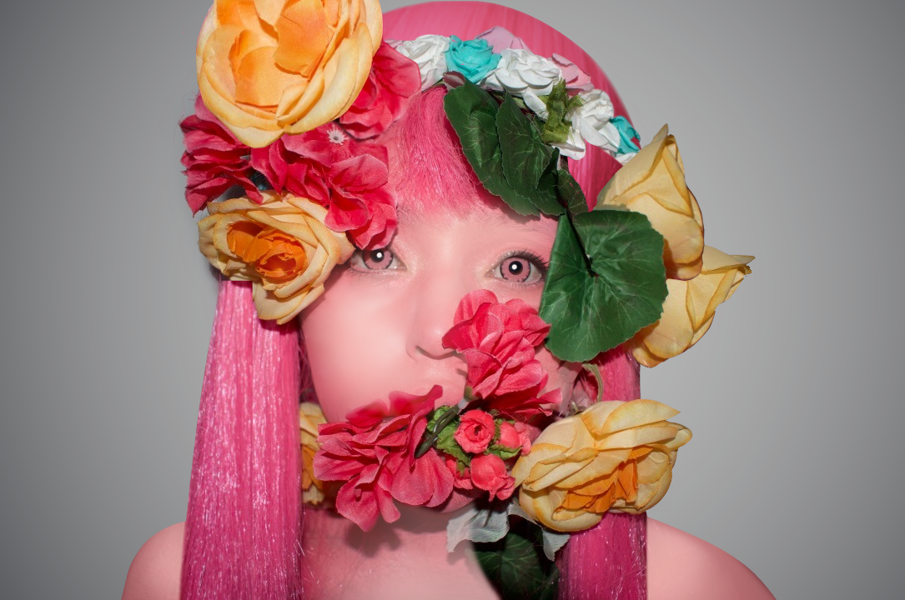
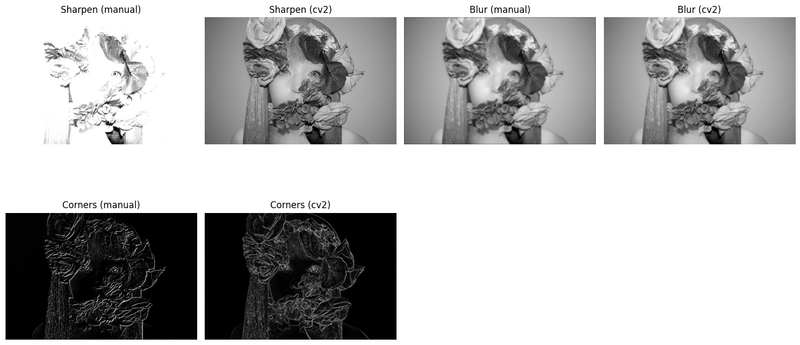

# 🧪 Taller Filtro Visual: Convoluciones Personalizadas

## 📅 Fecha
`2025-05-07` – Fecha de entrega

---

## 🎯 Objetivo del Taller
Diseñar e implementar filtros personalizados en imágenes para modificar bordes, difuminar o realzar detalles. Este taller busca profundizar en el concepto de convolución y su impacto visual en el procesamiento de imágenes.

Este repositorio contiene una implementación que demuestran el uso de **convoluciones personalizadas** en colab.

---

## 🧠 Conceptos Aprendidos

Principales conceptos aplicados:

- [ ] Transformaciones geométricas (escala, rotación, traslación)
- [ ] Segmentación de imágenes
- [ ] Shaders y efectos visuales
- [ ] Entrenamiento de modelos IA
- [ ] Comunicación por gestos o voz
- [X] Otro: Convoluciones

---

## 🔧 Herramientas y Entornos

Entornos usados:

Jupyter / Google Colab

---

## 🧪 Implementación

Proceso:

### 🔹 Etapas realizadas
1. Preparación de datos o escena.
2. Aplicación de modelo o algoritmo.
3. Visualización o interacción.
4. Guardado de resultados.

### 🔹 Código relevante

Incluye un fragmento que resuma el corazón del taller:

```python
# Manual 2D convolution
def apply_kernel(image, kernel):
    h, w = image.shape
    kh, kw = kernel.shape
    pad_h, pad_w = kh // 2, kw // 2

    # Pad the image
    padded = np.pad(image, ((pad_h, pad_h), (pad_w, pad_w)), mode='constant', constant_values=0)
    result = np.zeros_like(image, dtype=np.float32)

    # Convolve
    for i in range(h):
        for j in range(w):
            region = padded[i:i + kh, j:j + kw]
            result[i, j] = np.sum(region * kernel)
    
    return np.clip(result, 0, 255).astype(np.uint8)
```

## 📊 Resultados Visuales




## ✅ Checklist de Entrega

- [x] Carpeta `2025-05-03_taller10_convoluciones_personalizadas`
- [x] Código limpio y funcional
- [x] GIF incluido con nombre descriptivo (si el taller lo requiere)
- [x] Visualizaciones o métricas exportadas
- [x] README completo y claro
- [x] Commits descriptivos en inglés

---