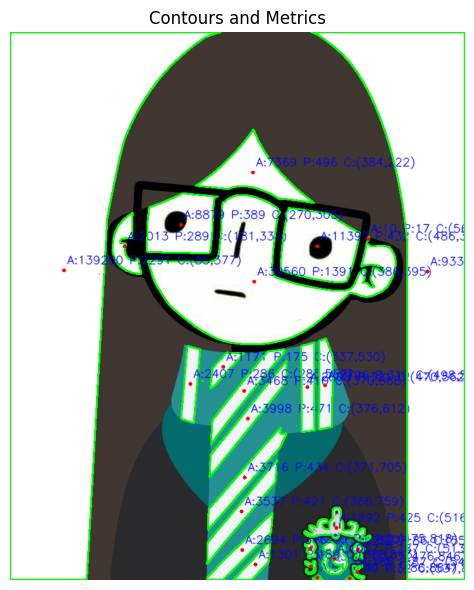

# 🧪 Taller Análisis de Figuras Geométricas: Centroide, Área y Perímetro

## 📅 Fecha
`2025-05-07` – Fecha de entrega

---

## 🎯 Objetivo del Taller
Detectar formas simples (círculos, cuadrados, triángulos) en imágenes binarizadas y calcular propiedades geométricas como área, perímetro y centroide. El objetivo es desarrollar habilidades para extraer métricas relevantes de contornos detectados en imágenes procesadas.

Este repositorio contiene una implementación que demuestran el uso de **propiedades geométricas** en colab.

---

## 🧠 Conceptos Aprendidos

Principales conceptos aplicados:

- [ ] Transformaciones geométricas (escala, rotación, traslación)
- [X] Segmentación de imágenes
- [ ] Shaders y efectos visuales
- [ ] Entrenamiento de modelos IA
- [ ] Comunicación por gestos o voz
- [ ] Otro: _______________________

---

## 🔧 Herramientas y Entornos

Entornos usados:

Jupyter / Google Colab

---

## 🧪 Implementación

Proceso:

### 🔹 Etapas realizadas
1. Preparación de datos o escena.
2. Aplicación de modelo o algoritmo.
3. Visualización o interacción.
4. Guardado de resultados.

### 🔹 Código relevante

Incluye un fragmento que resuma el corazón del taller:

```python
# Find contours
contours, _ = cv2.findContours(binary, cv2.RETR_EXTERNAL, cv2.CHAIN_APPROX_SIMPLE)

# Moments and centroid
M = cv2.moments(cnt)
if M["m00"] != 0:
    cx = int(M["m10"] / M["m00"])
    cy = int(M["m01"] / M["m00"])
else:
    cx, cy = 0, 0

text = f"A:{int(area)} P:{int(perimeter)} C:({cx},{cy})"
cv2.putText(output, text, (cx + 5, cy - 10), cv2.FONT_HERSHEY_SIMPLEX, 
          0.6, (255, 0, 0), 1, cv2.LINE_AA)

# Mark centroid
cv2.circle(output, (cx, cy), 3, (0, 0, 255), -1)
```

## 📊 Resultados Visuales



## ✅ Checklist de Entrega

- [x] Carpeta `2025-05-03_taller7_analisis_figuras_eometricas`
- [x] Código limpio y funcional
- [x] GIF incluido con nombre descriptivo (si el taller lo requiere)
- [x] Visualizaciones o métricas exportadas
- [x] README completo y claro
- [x] Commits descriptivos en inglés

---