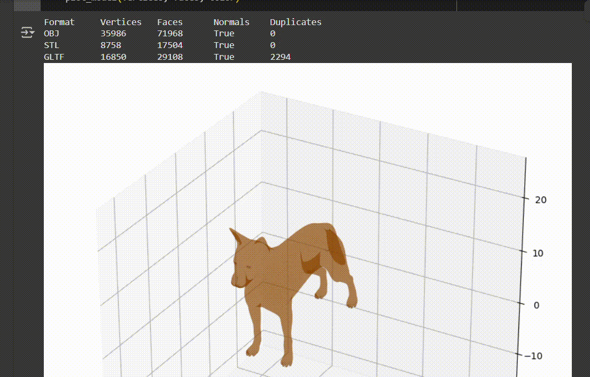
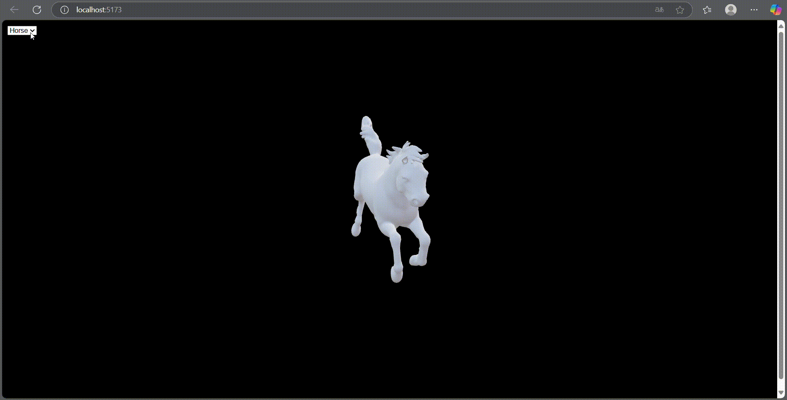
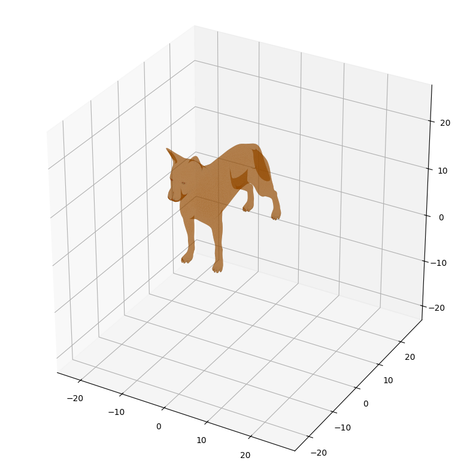
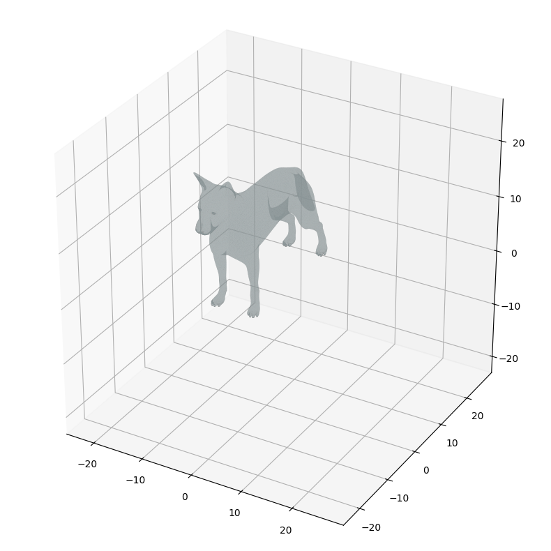
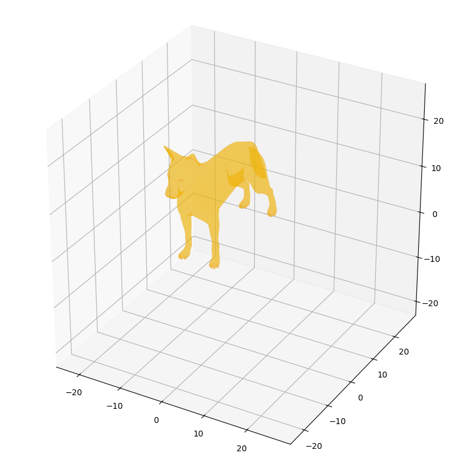
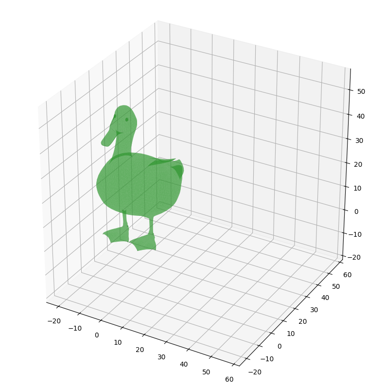
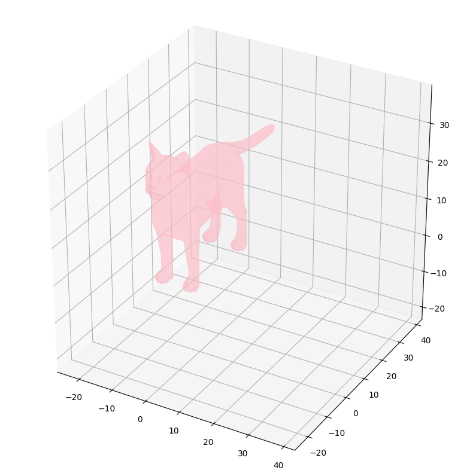

# 🧪 Taller Importando el Mundo: Visualización y Conversión de Formatos 3D

## 📅 Fecha
`2025-05-07` – Fecha de entrega

---

## 🎯 Objetivo del Taller
Comparar y convertir entre distintos formatos de modelos 3D: .OBJ, .STL y .GLTF, y visualizar sus diferencias en geometría y materiales. El objetivo es entender la estructura interna de los archivos 3D, su compatibilidad entre entornos, y cómo se interpretan en distintas plataformas de visualización.

Este repositorio contiene dos implementaciones que demuestran el uso de **entornos para estructuras 3d** en distintos entornos.

---

## 🧠 Conceptos Aprendidos

Principales conceptos aplicados:

- [X] Transformaciones geométricas (escala, rotación, traslación)
- [ ] Segmentación de imágenes
- [ ] Shaders y efectos visuales
- [ ] Entrenamiento de modelos IA
- [ ] Comunicación por gestos o voz
- [X] Otro: Entornos

---

## 🔧 Herramientas y Entornos

Entornos usados:

Three.js / React Three Fiber
Jupyter / Google Colab

---

## 🧪 Implementación

Proceso:

### 🔹 Etapas realizadas
1. Preparación de datos o escena.
2. Aplicación de modelo o algoritmo.
3. Visualización o interacción.
4. Guardado de resultados.

### 🔹 Código relevante

Incluye un fragmento que resuma el corazón del taller:

```python
# Convertions to save OBJ as STL and GLTF
mesh = meshes['OBJ']
mesh.export('converted_model_stl.stl')
mesh.export('converted_model_glft.gltf')
mesh.export('converted_model_glb.glb')  # or .stl, .gltf, .ply
```
```javascript
// Show enviroment with canvas
    <Canvas camera={{ position: [0, 2, 5], fov: 50 }}>
        <ambientLight intensity={0.5} />
        <directionalLight position={[5, 5, 5]} />
        <OrbitControls enableZoom={true} autoRotate autoRotateSpeed={2} />
        <Suspense fallback={null}>
          {activeModel === 'horse' && <Horse scale={22} position={[0, -1, 0]} />}
          {activeModel === 'cat' && <CatModel scale={0.05} position={[0, -1, 0]} />}
          {activeModel === 'stl' && <STLModel scale={0.05} position={[0, -1, 0]} />}
        </Suspense>
        <Environment preset="sunset" />
      </Canvas>
```
---

## 📊 Resultados Visuales









## ✅ Checklist de Entrega

- [x] Carpeta `2025-04-21_taller8_conversion_formatos_3d`
- [x] Código limpio y funcional
- [x] GIF incluido con nombre descriptivo (si el taller lo requiere)
- [x] Visualizaciones o métricas exportadas
- [x] README completo y claro
- [x] Commits descriptivos en inglés

---
