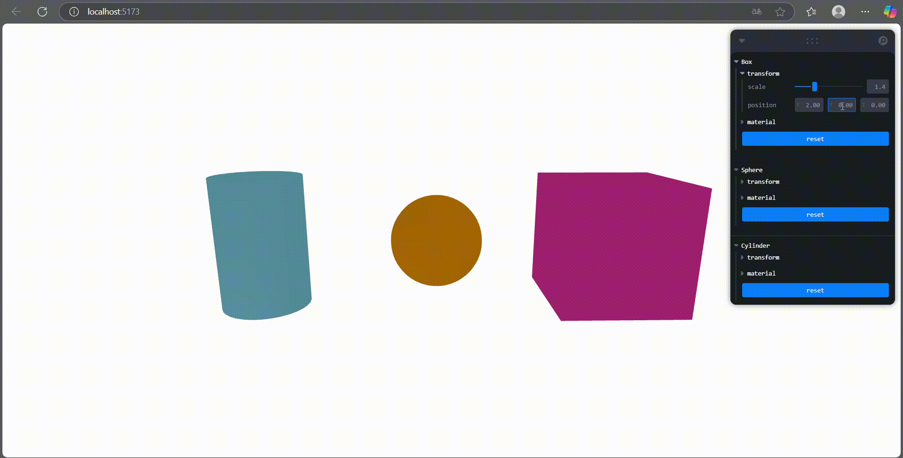
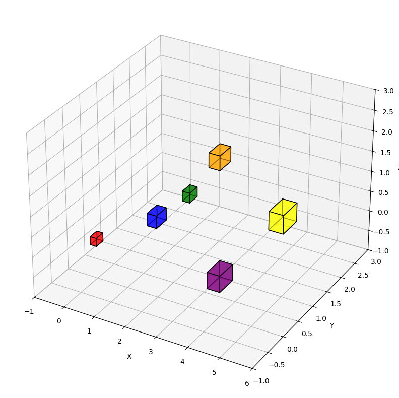
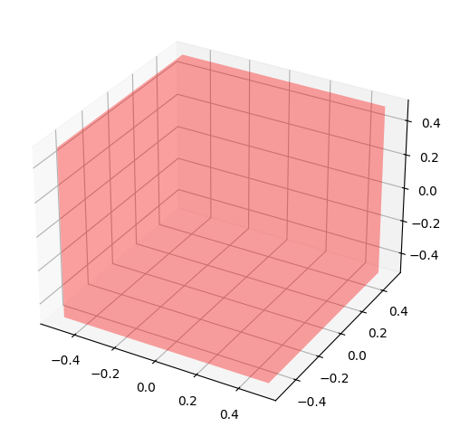
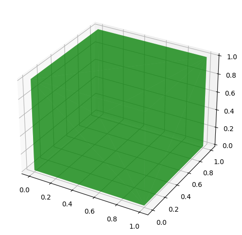

# 🧪 Taller Escenas Paramétricas: Creación de Objetos desde Datos

## 📅 Fecha
`2025-05-07` – Fecha de entrega

---

## 🎯 Objetivo del Taller
Generar objetos 3D de manera programada a partir de listas de coordenadas o datos estructurados. El propósito es entender cómo crear geometría en tiempo real y de forma flexible mediante código, utilizando bucles, estructuras condicionales y exportando o renderizando las escenas generadas.

Este repositorio contiene dos implementaciones que demuestran el uso de **escenas paramétricas** en distintos entornos.

---

## 🧠 Conceptos Aprendidos

Principales conceptos aplicados:

- [X] Transformaciones geométricas (escala, rotación, traslación)
- [ ] Segmentación de imágenes
- [ ] Shaders y efectos visuales
- [ ] Entrenamiento de modelos IA
- [ ] Comunicación por gestos o voz
- [X] Otro: Parametrización de objetos

---

## 🔧 Herramientas y Entornos

Entornos usados:

Three.js / React Three Fiber
Jupyter / Google Colab

---

## 🧪 Implementación

Proceso:

### 🔹 Etapas realizadas
1. Preparación de datos o escena.
2. Aplicación de modelo o algoritmo.
3. Visualización o interacción.
4. Guardado de resultados.

### 🔹 Código relevante

Incluye un fragmento que resuma el corazón del taller:

```python
# Create a single 3D object — for example, a Sphere
sphere = vedo.Sphere(pos=[0, 0, 0], r=1.0, c='skyblue')

# Display the object (optional)
vedo.show(sphere, axes=1, title="Single Sphere")

# Export only this sphere to OBJ
vedo.write(sphere, "single_sphere.obj")

# Create a unit cube centered at the origin
cube = trimesh.creation.box(extents=(1, 1, 1))

# Export cube as STL binary format
stl_data = export.export_mesh(cube, 'cube_exported.stl', file_type='stl')

# Create a Cube using Open3D
cube = o3d.geometry.TriangleMesh.create_box(width=1.0, height=1.0, depth=1.0)

# Export Cube to OBJ file
o3d.io.write_triangle_mesh("cube.obj", cube)
```
```javascript
function Tweakable() {
  const [{ scale, position, color, wireframe }, set] = useControls("Figure", () => ({
    transform: folder({
      scale: { value: 1, min: 0.4, max: 4, step: 0.2 },
      position: [0, 0, 0],
    }),
    material: folder({
      color: "#333",
      wireframe: false,
    }),
    reset: button(() =>
      set({
        scale: 1,
        position: [0, 0, 0],
        color: "#333",
        wireframe: false,
      })
    ),
  }));
} 
```
---

## 📊 Resultados Visuales







## ✅ Checklist de Entrega

- [x] Carpeta `2025-04-21_taller9_escenas_parametricas`
- [x] Código limpio y funcional
- [x] GIF incluido con nombre descriptivo (si el taller lo requiere)
- [x] Visualizaciones o métricas exportadas
- [x] README completo y claro
- [x] Commits descriptivos en inglés

---